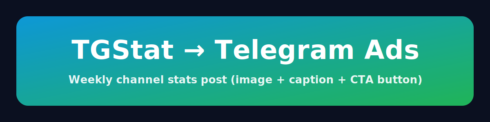

# tgstat-to-ads

<p align="center">
  
</p>

<p align="center">
  <a href="https://github.com/kkulebaev/tgstat-to-ads/actions/workflows/ci.yml"></a>
  <a href="https://github.com/kkulebaev/tgstat-to-ads/pulls"></a>
  
  
  
</p>

A tiny cron-style Node.js app that posts Telegram channel statistics (from TGStat) to a Telegram channel as **one photo message** (TGStat widget image + HTML caption + inline CTA button).

## Features

- Weekly scheduled run (Railway Cron Job)
- Deletes the previous stats message before posting a new one
- Fetches TGStat `/channels/stat` JSON and maps metrics into a readable caption
- Downloads the TGStat widget PNG and uploads it as a Telegram photo
- Attaches an inline CTA button directly to the photo message
- Stores the last Telegram `message_id` in Postgres
- Optional `TG_STAT_MOCK` mode to run without calling TGStat (useful when API limits are hit)

## Requirements

- Node.js 22+
- Postgres (Railway Postgres works great)
- Telegram Bot token
- TGStat API token

## Environment variables

Required:

- `DATABASE_URL` — Postgres connection string
- `TELEGRAM_ADS_BOT_TOKEN` — Telegram bot token
- `TELEGRAM_CHAT_ID` — target chat/channel id (e.g. `-100...`)
- `TGSTAT_TOKEN` — TGStat API token
- `TGSTAT_CHANNEL_ID` — TGStat channel id
- `TGSTAT_WIDGET_URL` — TGStat widget image URL (`.../stat-widget.png`)
- `CTA_URL` — URL used in the inline button

Optional:

- `PORT` — default `3000` (not used in cron mode, but kept for compatibility)
- `TG_STAT_MOCK` — set to `1` or `true` to use mocked TGStat data

## Local development

```bash
npm i
npm run typecheck
npm test

# Run one-off locally
npm run cron
```

## Railway setup

1. Create a new Railway project and connect this repository.
2. Add Postgres (Railway plugin) → it will provide `DATABASE_URL`.
3. Set the environment variables listed above.
4. Create a **Railway Cron Job**:
   - Build command: `npm ci && npm run build`
   - Run command: `npm run cron:prod`
   - Schedule: every Monday at 08:00 UTC (or whatever you need)

## Notes

- Telegram photo captions have a size limit. If the caption becomes too long, you may need to shorten it or split into multiple messages.

## License

MIT — see [LICENSE](LICENSE).
